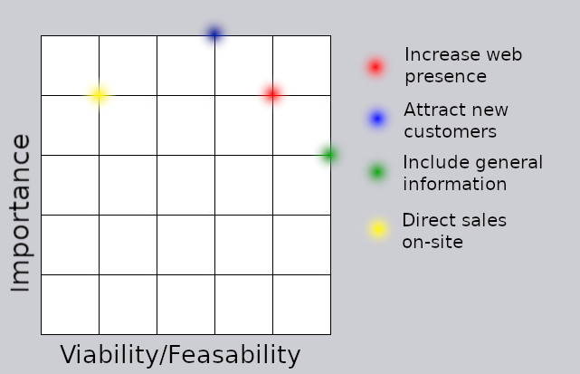
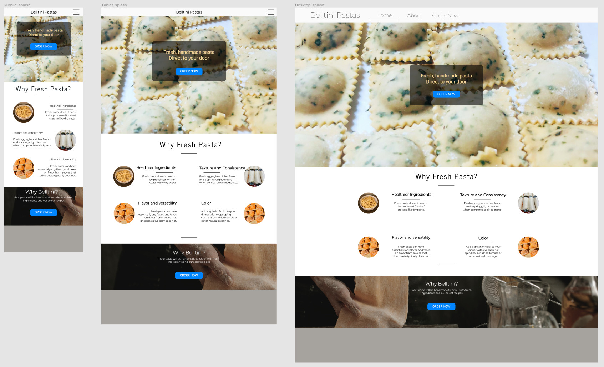
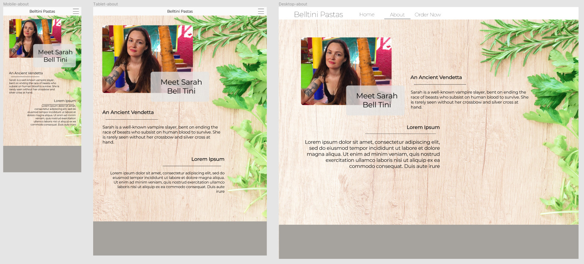
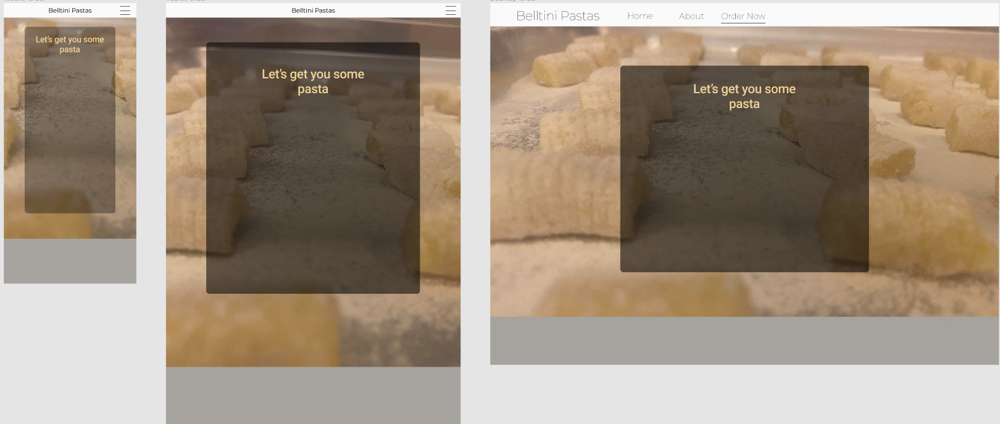

# Belltini

[View the page on github here](jdygard.github.io/belltini "Belltini Homepage")

## Table of Contents

1. [Introduction](#Introduction)  
2. [UX](#ux)  
    i.   [User stories](#user-stories)  
    ii.  [Planes of UXD](#design-planes)  
    iii. [Strategy](#strategy)  
    iv.  [Scope](#scope)  
    v.   [Structure](#structure)  
    vi.  [Skeleton](#skeleton)  
    vii. [Surface](#surface)  
3. [Current Features](#Current-Features)  
    i. [Nav Bar](#nav-bar)  
    ii. [Footer](#footer)  

## Introduction 

This streamlined website is built for Belltini Pastas, an Indianapolis, Indiana based business selling bespoke fresh formed and stuffed pastas. The primary focus of this site is as a portal to sell pasta, but will also serve to expand knowledge and web-presence of the Belltini brand.
Belltini currently sells pastas intermittently to local restaurants and a limited set of local private consumers. With this site, the purpose is to expand the pool of customers and provide a professional face for the brand.
Additionally, this is built as the first of four "Milestone Projects," building the developer's portfolio and as a demonstration of the developer's understanding of HTML5 and CSS components.

[Back to Top](#belltini)
***
## UX
### Users:
1. Current commercial customers
2. New commercial customers
3. Current private consumers
4. New private customers

[Back to Top](#belltini)

***

## User Stories
### Current commercial customers
1. As a current commercial customer, I want to find pictures and information about new products, 
2. As a current commercial customer, I want to review, sample or purchase current products not yet on my 
restaurant menu.
### Potential commercial customers
1. As a potential new commercial customer, I want to be assured of a commitment to quality.
2. As a potential new commercial customer, I want to easily find information about products 
3. As a potential new commercial customer, I want to be inspired to add or modify my restaurant's menu with products from Belltini.
4. As a potential new commercial customer, I want to be able to easily contact Belltini with questions or orders.
### Current private customers
1. As a current private consumer, I am interested in finding products I haven't yet tried.
2. As a current private consumer, I want to easily place orders.
### Potential new private customers
1. As a new private customer, I want to see why I should choose to buy fresh, handmade pasta for a premium price rather than machine-made from the grocery store.
2. As a new private customer, I want to see product images or learn about fresh pasta in general.
3. As a new private customer, I want to easily place orders.

[Back to Top](#belltini)
***
## Design Planes
### Strategy
#### Who is this website for, and what does it do?
1. Audience
    1. New and current commercial customers, new and current private customers
    2. Fresh, handmade pasta has a short shelf-life, and a high cost per portion. This means that it is less practical and more expensive.
        Private consumers will likely either be young (20-29 years old) and sporadic, or 30+ years old. The target audience is thus older and accustomed to professionalism and clean, modern UI.
        Commercial customers will be high-end restauranteurs with expectations of clean, modern UI with concise information about the products.
2. Functional requirements
    1. Easy access to information, like new products, flavors, styles and biography.
    2. Ability to order the product.
    3. Ability to contact the business.
3. Benefit to Belltini
    1. The website should present a professional public face.
    2. The website should provide access to the product.
    3. The website should attract new customers.

### Importance/Feasability curves (graphic above)
1. Increase web presence: Developer gives this a 4/4. Having a web presence is important but not the central goal of the business. Through search engine optimization and accessible design, this goal is very achievable for the the developer.
2. Attract new customers: Developer gives this a 5/3. The core goal of the business is to sell pasta, and the website should serve this goal as centrally as possible. However, the site is only part of the business strategy for the attraction of customers. The owner will be distributing business cards, courting businesses and relying on some amount of "word of mouth" business. The site and developer will serve this goal by providing an accessible website that advertises the product and business as attractively as possible.
3. Include general information: Developer gives this a 3/5. This serves the site's goal of attracting new customers by teaching them the benefits of the product and familiarizing them with the business and owner themselves. Though it isn't crucial to the site's goals, it is "low-hanging-fruit."
4. Direct sales on-site: Developer gives this a 4/1. The developer has little skill in JS and Python and thus no ability to provide this service. The live version of the site passed on to the actual business owner has a page with simple contact information and instructions. The version of the site submitted for grading at Code Institute (and the version available on github) has a mockup of what the order form might look like.
***
### Scope
#### What's on the table in terms of features?
1. User is able to purchase the product.
2. User is able to learn about the product.

    i. Through highlighting the benefits of fresh pasta in general and Belltini in particular.

    ii. Video and images that intrigue and tempt the user to purchase.
3. User is able to learn about the business and the chef.
### Structure
#### How is the information structured and grouped?
1. A splash home page with small bits of easily-digestible information and direct links to the order page.
2. Multiple pages with deeper dives into each avenue of information

    i. A "Learn More" page with a video of fresh pasta being made by a master chef.

    ii. A gallery page featuring pastas made by Belltini

    iii. A biographical page with information about the chef.
3. An explicit and structured page with an order form.
### Skeleton
#### How do we represent this information? How does the user find it?
1. The home page features snippets of information with links to learn more at each step.
2. The nav bar is clear and explicit about the information to be found on each page.
### Surface
#### What does it look like?
1. Customers of this page will expect a clean, light, modern design with clear, simple features arranged intuitively. 

    i. Because this site is intending to generally appeal to anyone who might order professionally made ingredients, and specifically to higher-income people, a modern, clean style was chosen. This includes minimalistic features to highlight large, emotionally involving imagery featuring the product. 
    
    ii. The colors were chosen for this minimalistic, clean design, following a color pallette one might find in a bright kitchen like off-white and light-colored wood.

    iii. Font: Montserrat was chosen for most informational features for its clean, modern look. Roboto was used for buttons, forms and hero image boxes because of its high visibility while retaining some modern tone.

    iv. Navigation: Nav is as clean, efficient and intuitive as possible while retaining functionality.

[Back to Top](#belltini)
***
## Current Features
### <strong>[Splash Page](index.html)</strong>

All of the background images used on this page have three versions at different resolutions and orientations to fit the responsive adjustments for smaller screens. This was done to reduce load times on mobile devices. The three content sections of the page are:
1. A "Hero" section. A hero image dominates the screen on arrival. The image is of Belltini pasta, up close and in high resolution. This image was chosen because it highlights many features of the Belltini brand. They are orderly, uniform and neat, highlighting the professionalism involved; they are obviously fresh, still covered by and sitting with the flour used to make them; they are colorful and eyecatching. Immediately, a transparent box appears featuring a call to visit the order page with a visible button.
2. A "Why Fresh Pasta?" section highlighting the benefits of fresh pasta over dry, with images that clarify each point. To contrast the bright, dominating image above in the hero section, this section is minimalistic. Images were chosen to highlight each point. On larger screens, symmetry was the design ethic, showing 4 highlights. On smaller screens, the fourth is hidden while the remaining three are displayed in a column. Below this is a link to the Learn More page which will touch more exhaustively on each of these points.
3. A "Why Belltini?" section that briefly says why you should pick Belltini pasta. The background image is from Pexel. The image chosen elicits the labor involved in handcrafted pasta. The dark background provides a perfect frame for our text.
    
### <strong>[Learn More Page](learn_more.html)</strong>
Features a video of fresh pasta being made by a professional.

### <strong>[Selection Page](gallery.html)</strong>
A gallery page featuring some of the products made by Belltini. Lightbox2 was used, with custom alignment and responsiveness. If the developer were more skilled in JS, this style of page would have been used as the order page, with each image chosen used to highlight the aspect being selected.
    
### <strong>[About Page](about.html)</strong>
A simple biography page. A profile picture of the chef, with a small, contrasting "meet belltini" box below. Two blurbs with two paragraphs of biographical information sit beside and/or below depending on the viewport size. The background image (from pexels.com) has been edited to ease reading to the content in the middle of the page.

### <strong>[Order Page](order_now.html)</strong>
A hero image with a semi-transparent box containing the order form. Order form contains the only explicit javascript on the site. When selecting a stuffed pasta, the menu for fillings is revealed. If an unstuffed pasta is chosen, the menu is hidden again. There is a comment box present for special orders. There is a form for the email and name. Below is a map section, headered with "Want to try our pasta before ordering?" The map shows the location of a restaurant that serves Belltini pastas.

### Nav bar
The navbar is a typical responsive navigational element. The logo is placed in the left side. Five navigational links are arranged to its right on larger screens, and collapsed into a button on smaller. Hover code is normal bootstrap navbar code, but the parts have been moved to suit the designed layout of the page.

### Footer
The footer is a minimalistic element on this page. The current social media presence of Belltini is limited to her instagram, so a link to that and a link to a restaurant that serves her pasta is there. On smaller screens, the links are in a column, on larger screens they spread out for the minimalistic feel.

[Back to Top](#belltini)
***
## ISSUES AND BUGS
### Nav bar

## CREDITS
### Technologies used
1. JQuery
2. Javascript
3. Lightroom
4. CSS
5. HTML5

### Code credits
1. The nav element was loosely adapted from the example given on the [bootstrap navbar page](https://getbootstrap.com/docs/4.0/components/navbar/)
2. The gallery page was adapted from a free code snippet provided by [Bootstrapious](https://bootstrapious.com/p/bootstrap-photo-gallery).
3. Sticky Footers thanks to [DesignModo](https://help.designmodo.com/article/startup-sticky-footer/)

### Acknowledgements
* Seun Owanikoko
* My friends and family who patiently looked at multiple iterations of my site.

[Back to Top](#belltini)
